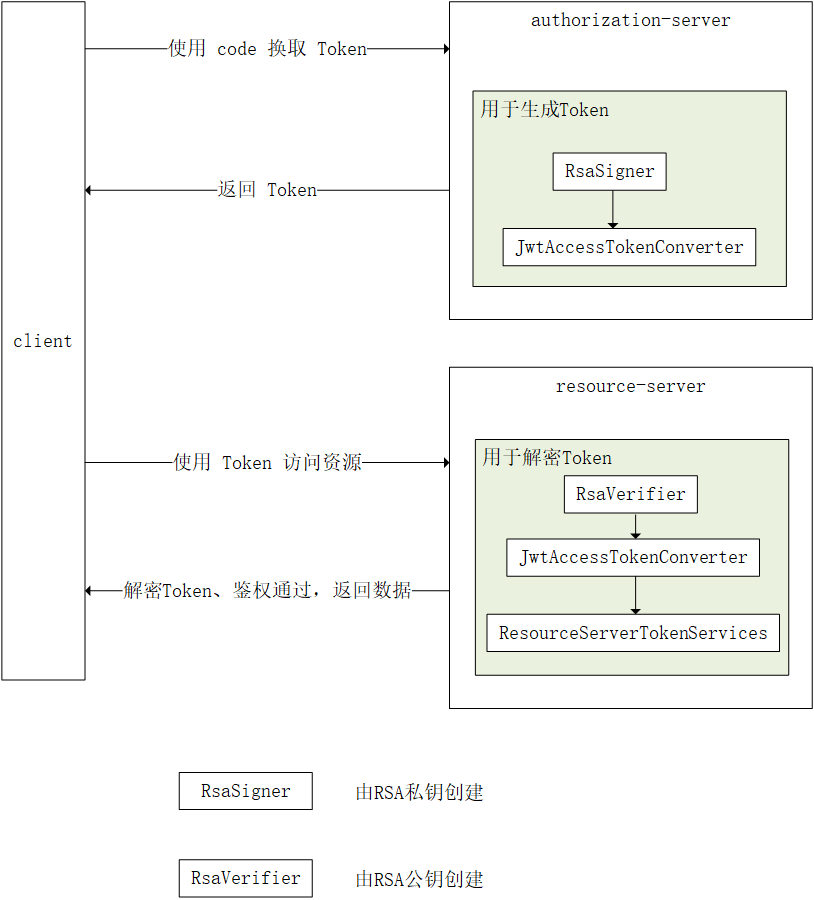

# spring-boot-oauth2-jwt

Spring Boot OAuth2 JWT

## SQL

|  字段   | 值  |
|  ----  | ----  |
| username  | xuxiaowei |
| password  | 123 |
| client_id  | 5e03fb292edd4e478cd7b4d6fc21518c |
| client_secret  | da4ce585e30346d3a876340d49e25a01 |

## 分支

- [Jwt_Token](https://github.com/xuxiaowei-com-cn/spring-boot-oauth2-jwt/tree/Jwt_Token)

- [Jwt_Token_RSA](https://github.com/xuxiaowei-com-cn/spring-boot-oauth2-jwt/tree/Jwt_Token_RSA)
    - 直接使用 RSA 公钥与私钥配置，更方便管理（集成微服务时放在配置中心）
